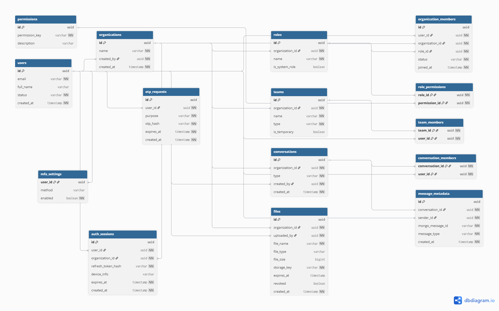

# 📘 Organization Communication App – Database Design

## 📌 Overview

This repository documents the **database schema and relationship mapping** for a scalable, secure organization communication application.

The application is designed as a **multi-tenant system**, where:
- A single user can belong to multiple organizations
- Each organization defines its own roles and permissions
- Communication includes direct messages, group chats, and broadcasts
- Files can be shared securely within organizations
- Enterprise security features such as RBAC, MFA, and session control are supported

At this stage, the repository focuses on **database architecture and design decisions**.  
The complete application (Flutter mobile app + backend services) will be added in later phases.

---

## 🧱 Database Architecture Summary

The system follows a **hybrid storage architecture**:

### **PostgreSQL (Primary Database)**
Used as the *source of truth* for:
- Users and organizations
- Role-Based Access Control (RBAC)
- Authentication, sessions, OTP, and MFA data
- File metadata
- Message metadata and relationships

### **MongoDB**
Used for:
- Storing encrypted chat message payloads at scale

### **Object Storage**
Used for:
- Storing uploaded files (documents, images, media)
- Secure access via temporary signed URLs

This separation ensures **scalability, security, and maintainability**.

---

## 🧩 Core Design Principles

- **Multi-Organization Support**  
  Users may belong to multiple organizations with different roles.

- **Strict Tenant Isolation**  
  All data access is scoped by `organization_id`.

- **Flexible RBAC**  
  Roles and permissions are fully customizable per organization.

- **Scalable Messaging**  
  High-volume chat data is handled outside the relational database.

- **Security-First Design**  
  Supports MFA, OTP, session tracking, access revocation, and auditing.

---

## 🗂️ Database Tables Overview

### **1️⃣ Identity & Organization**
- `users` – Global user identity
- `organizations` – Tenant (company) entity
- `organization_members` – Maps users to organizations with assigned roles

### **2️⃣ Role-Based Access Control (RBAC)**
- `roles` – Organization-specific roles
- `permissions` – Atomic actions
- `role_permissions` – Role-to-permission mapping

### **3️⃣ Teams & Groups**
- `teams` – Departments or project-based groups
- `team_members` – User membership in teams

### **4️⃣ Messaging Metadata**
- `conversations` – Direct, group, or broadcast chats
- `conversation_members` – Chat participants
- `message_metadata` – Relational references to MongoDB messages

### **5️⃣ File Handling**
- `files` – File metadata (actual files stored in object storage)

### **6️⃣ Authentication & Security**
- `auth_sessions` – Active user sessions scoped by organization
- `otp_requests` – OTP verification records
- `mfa_settings` – Multi-factor authentication configuration

---

## 🔗 Relationship Mapping (High Level)

- A **user** can belong to multiple **organizations**
- An **organization** defines its own **roles**
- A **role** grants multiple **permissions**
- **Teams** group users within an organization
- **Conversations** define messaging contexts
- **Messages** are stored externally and linked via metadata
- **Files** belong to organizations and are access-controlled
- **Sessions and MFA** enforce secure access

> **Important Rule:**  
> Every sensitive operation is validated using both `user_id` and `organization_id`.

---

## 🖼️ Entity Relationship Diagram (ERD)

The ER diagram visually represents the database structure and relationships.

